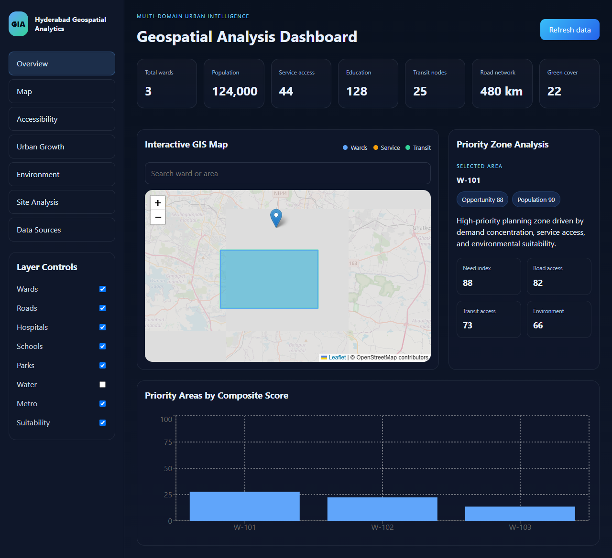
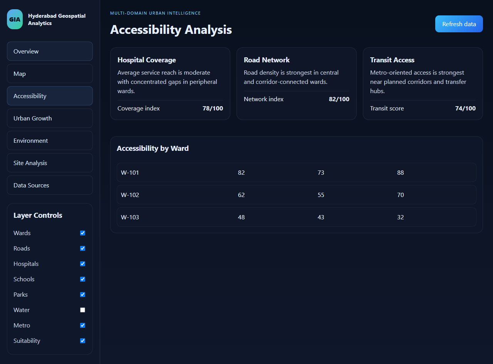
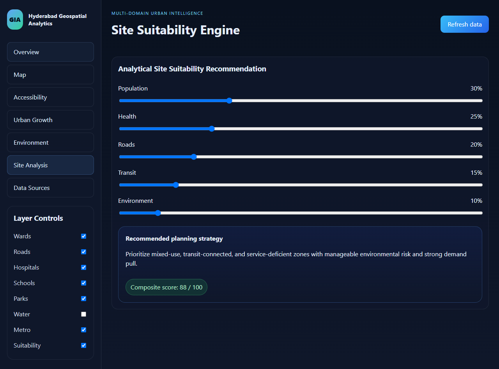
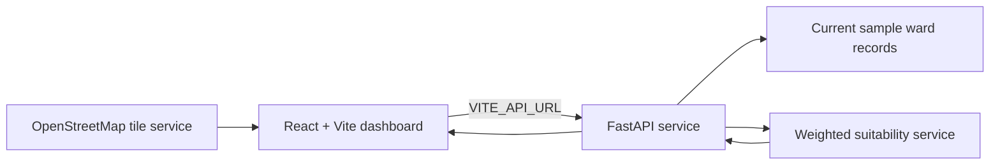

# Hyderabad Geospatial Analytics

An interactive urban-planning dashboard prototype for exploring ward-level indicators and comparing potential public-service investment areas in Hyderabad, Telangana.

[](https://multi-modal-geospatial-urban-planning-b8sh.onrender.com)

> **Deployment status:** The dashboard is publicly available. The frontend currently falls back to demonstration values because its request to the API is blocked by CORS. See [Connect the deployed API](#connect-the-deployed-api) to finish that configuration. Current ward records and several indicators are sample/demo values, not authoritative citywide data.

## Dashboard



The screenshot is captured from the live deployment. Map tiles require an internet connection and may take a moment to load.

### Analysis views

| Accessibility | Site suitability |
| --- | --- |
|  |  |

## What It Includes

- **Overview and map:** Leaflet map, ward search, layer toggles, summary indicators, and a composite-score chart.
- **Analysis views:** Accessibility, urban growth, environmental indicators, and site suitability.
- **Suitability scoring:** A weighted multi-criteria service ranks the available planning records and returns score components.
- **API:** FastAPI endpoints for health, ward records, summary indicators, and suitability analysis.
- **Reproducible development:** Vite/React frontend, Python backend, tests, and Docker configuration.

## Live Demo and API

| Service | Address |
| --- | --- |
| Dashboard | [multi-modal-geospatial-urban-planning-b8sh.onrender.com](https://multi-modal-geospatial-urban-planning-b8sh.onrender.com) |
| API health | Add the API service URL followed by `/health` |
| Interactive API docs | Add the API service URL followed by `/docs` |

The API host is a separate Render service. It is not the dashboard host; use the API service's URL from the Render dashboard.

## Architecture



The repository includes PostGIS and data-source scaffolding, but the deployed API currently serves in-code sample records. The external data ingestion and database-backed analysis are not yet connected to the dashboard.

## Tech Stack

- **Frontend:** React, TypeScript, Vite, Leaflet / React Leaflet, Recharts
- **Backend:** Python, FastAPI, Pydantic
- **Spatial/data tooling:** GeoPandas, Shapely, PyProj, Pandas, NumPy, scikit-learn
- **Persistence and local services:** PostgreSQL/PostGIS, Docker Compose
- **Hosting:** Render static site and web service

## Run Locally

Requirements: Python 3.11 or newer, Node.js 20 or newer, and npm.

From PowerShell at the repository root:

```powershell
py -m venv .venv
.\.venv\Scripts\Activate.ps1
python -m pip install -r requirements.txt
Copy-Item .env.example .env
```

Start the API in one terminal:

```powershell
uvicorn backend.main:app --reload --port 8000
```

Start the frontend in a second terminal:

```powershell
Set-Location frontend
npm ci
npm run dev
```

Open `http://localhost:5173`. The frontend defaults to the local API at `http://localhost:8000`. API docs are at `http://localhost:8000/docs`.

### Docker Compose

With Docker Desktop running, use the repository's development stack:

```powershell
Copy-Item .env.example .env
docker compose up --build
```

The dashboard is at `http://localhost:5173` and the API is at `http://localhost:8000`. Compose starts PostGIS, but the current sample-data endpoints do not persist their ward records to it.

## Render Deployment

The public dashboard is deployed as a Render **Static Site** and the API should be deployed separately as a Render **Web Service** using the repository `Dockerfile`.

### Static site settings

| Setting | Value |
| --- | --- |
| Branch | `main` |
| Root directory | Leave blank |
| Build command | `cd frontend && npm ci && npm run build` |
| Publish directory | `frontend/dist` |
| Environment variable | `VITE_API_URL` = API service base URL, with no trailing slash |

### API service settings

Use the repository root and `Dockerfile`. Configure:

| Variable | Value |
| --- | --- |
| `APP_ENV` | `production` |
| `FRONTEND_ORIGIN` | Exact public dashboard origin, including `https://` |

After setting variables, redeploy the relevant service. Keep secrets out of GitHub and configure them through Render's environment settings.

### Connect the deployed API

Browser verification of the live dashboard found its request to `https://multi-modal-geospatial-urban-planning.onrender.com/api/v1/analysis/summary` is blocked because the API response does not include an `Access-Control-Allow-Origin` header. In Render:

1. Open the API Web Service and confirm `VITE_API_URL` on the Static Site points to this API service's correct base URL.
2. Set the API Web Service's `FRONTEND_ORIGIN` to `https://multi-modal-geospatial-urban-planning-b8sh.onrender.com` exactly, with no path or trailing slash.
3. Save and redeploy the API service.
4. Reload the dashboard and confirm its API requests no longer show CORS errors in the browser console. Verify `<API_URL>/health` and `<API_URL>/api/v1/analysis/summary` directly as well.

The frontend currently catches API failures and displays fallback values, so seeing a rendered page alone does not prove the API connection is healthy.

## API Endpoints

| Method | Path | Purpose |
| --- | --- | --- |
| `GET` | `/health` | Service health |
| `GET` | `/api/v1/wards` | Available sample ward records |
| `GET` | `/api/v1/analysis/summary` | Summary indicators |
| `POST` | `/api/v1/analysis/site-suitability` | Rank records using supplied weights |
| `GET` | `/api/v1/analysis/results/{result_id}` | Retrieve a ward result |

Interactive documentation is served at `/docs` and `/redoc`.

## Suitability Model

The default weighted criteria are population demand (0.30), hospital gap (0.25), road accessibility (0.20), transit accessibility (0.15), and environmental score (0.10). The result is a planning aid, not a legal approval or a substitute for site surveys, land ownership checks, or professional review.

## Data Scope and Limitations

- The current API returns **three demonstration ward records**. It does not include all Hyderabad wards or provide a citywide location selector.
- Demo ward IDs, approximate map geometry, and several displayed indicators must not be interpreted as official boundaries or measured city statistics.
- The data-source cards describe intended sources; TGRAC, OpenStreetMap, GTFS, Census, and Copernicus ingestion is not yet a complete automated production pipeline.
- A PostGIS service is included in the local Docker Compose setup, but the current API analysis endpoints use in-memory sample data.
- Public OpenStreetMap tiles require browser internet access and follow OpenStreetMap's tile usage policy.

## Tests

From the repository root:

```powershell
python -m pytest -q
```

Build the frontend:

```powershell
Set-Location frontend
npm ci
npm run build
```

## Project Layout

```text
backend/       FastAPI routes, settings, and analysis services
frontend/      React dashboard and map
data/          Raw and processed dataset locations
docs/          Architecture notes and screenshots
scripts/       Analysis runner
sql/           PostGIS schema and indexes
tests/         Backend and suitability tests
```

## Roadmap

- Ingest verified GHMC/TGRAC ward boundaries and publish provenance and dates.
- Connect open transport, service, population, and environmental data to the API.
- Persist validated spatial layers in PostGIS and remove misleading fallback metrics.
- Add ward selection/comparison and exportable analysis reports.

## Attribution and License

When real datasets are added, retain source attribution and follow each dataset's license and usage conditions. Map tiles are © OpenStreetMap contributors. See [LICENSE](LICENSE) for the project license.
