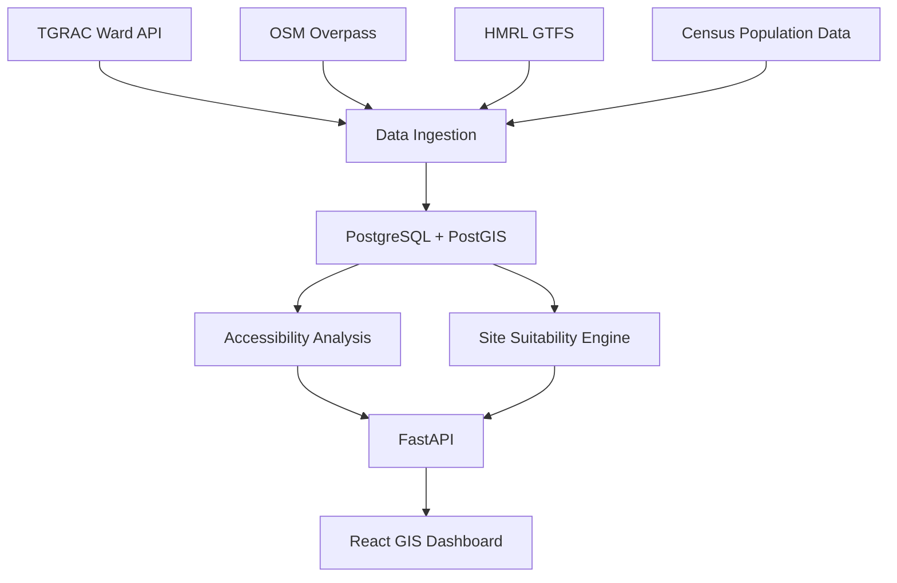

# Multi-Modal Geospatial Urban Planning — Hyderabad

This project is a portfolio-ready geospatial decision-support platform for Hyderabad, Telangana, India. It combines ward-level planning data, accessibility metrics, and a multi-criteria site-suitability model to help urban planners evaluate locations for a new public hospital.

## 1. Overview

The platform follows a practical hybrid data strategy that prefers official and open-source geospatial datasets while clearly documenting where data is missing or uncertain. The initial production-ready implementation focuses on the analytical site-suitability workflow and includes a FastAPI backend, React dashboard, and reproducible data-processing scripts.

## 2. Problem Statement

Urban planning requires a transparent way to compare spatial demand, service coverage, accessibility, and environmental constraints. This project models those factors for Hyderabad so planners can inspect candidate areas and understand why a given ward or planning area ranks highly.

## 3. Objectives

- Build a geospatial urban analytics workflow for Hyderabad.
- Combine ward, road, hospital, transport, and environmental indicators.
- Rank planning units using a weighted multi-criteria decision analysis model.
- Expose data through a FastAPI service and interactive web dashboard.
- Keep the platform reproducible and easy to extend with newer data sources.

## 4. Key Features

- Ward-level planning suitability scoring
- Hospital and metro accessibility metrics
- Weighted site-suitability engine
- FastAPI endpoints with Pydantic validation
- React dashboard with KPI cards and map layer toggles
- Docker and PostgreSQL/PostGIS configuration
- Sample and reproducible analysis scripts

## 5. Architecture



## 6. Data Sources

- TGRAC ArcGIS ward boundaries
- OpenStreetMap Overpass for roads, hospitals, schools, parks, water, and transport features
- HMRL GTFS for metro stations and routes
- Census population inputs for demand estimation
- Copernicus integration is prepared but intentionally optional and inactive without credentials

## 7. Data Acquisition

Raw datasets are expected under the project data folders:

- `data/raw/transport/` for GTFS ZIP files
- `data/raw/population/` for census files
- `data/processed/` for cleaned outputs

The project does not fabricate missing values. If a source is missing, the relevant analysis uses an explicit fallback message or a cautionary score.

## 8. Technology Stack

- Python 3.11+
- FastAPI
- SQLAlchemy
- GeoPandas, Shapely, PyProj
- Pandas, NumPy, scikit-learn
- React, Vite, TypeScript, Leaflet, Recharts
- PostgreSQL + PostGIS
- Docker Compose

## 9. Project Structure

- `backend/` — API and analytics services
- `frontend/` — dashboard and map UI
- `scripts/` — ingestion and analysis runners
- `data/` — raw and processed datasets
- `tests/` — automated validation tests
- `docs/` — methodology and limitations notes

## 10. Installation

```bash
python -m venv .venv
source .venv/bin/activate
python -m pip install -r requirements.txt
```

## 11. Configuration

Copy the example environment file and adjust values as needed:

```bash
cp .env.example .env
```

## 12. Database Setup

The repository includes a PostgreSQL + PostGIS configuration in `docker-compose.yml`:

```bash
docker compose up -d postgres
```

## 13. Data Ingestion

The system includes scripts for ingestion and analytical processing:

```bash
python scripts/run_analysis.py
```

Additional ingestion entry points are defined in the project structure and can be expanded for TGRAC, OSM, GTFS, and census workflows.

## 14. Running Backend

```bash
uvicorn backend.main:app --reload
```

## 15. Running Frontend

```bash
cd frontend
npm install
npm run dev -- --host 0.0.0.0
```

## 16. GIS Analysis

The application computes ward-level metrics including population, route and road density, hospital access, and metro accessibility. These metrics are normalized before site-suitability scoring.

## 17. Hospital Suitability Methodology

The final suitability score is computed as a weighted sum of normalized criteria. The recommended default weights are:

- Population Demand: 0.30
- Hospital Gap: 0.25
- Road Accessibility: 0.20
- Metro Accessibility: 0.15
- Environmental Factor: 0.10

The output is labeled as an analytical site suitability recommendation rather than a legal planning approval.

## 18. API Documentation

FastAPI automatically exposes Swagger documentation at:

- `/docs`
- `/redoc`

## 19. Screenshots

Screenshots can be added to the `docs/` folder or repository wiki as the project evolves.

## 20. Testing

```bash
python -m pytest -q
```

## 21. Limitations

- The project does not claim to determine legal hospital approval or land ownership.
- Census and ward alignment may require a manual review in real-world deployments.
- Satellite-derived environmental indicators remain optional when Copernicus credentials are unavailable.

## 22. Future Work

- Add real PostGIS ingestion pipelines for TGRAC and OSM data.
- Add parcel-level suitability if land-use products become available.
- Add Copernicus NDVI workflows with credentialed access.
- Improve the ML module for urban-growth prediction.

## 23. Data Attribution

This project uses official and open data sources where available, including TGRAC, OpenStreetMap, HMRL GTFS, and Census India materials. Users must confirm data licensing and usage conditions for their application.

## 24. License

This project is distributed under the MIT license unless otherwise specified in the repository.
